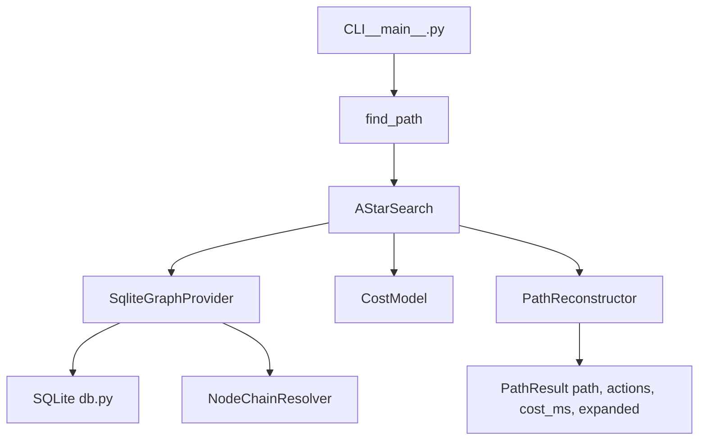

# Design Document

## Overview
Implement an A* pathfinding service that finds the least-cost route between two tiles using data from `worldReachableTiles.db`. The graph includes:
- Tile adjacency from `tiles.allowed_directions` (8-directional)
- Door links from `door_nodes`
- Teleport links from `lodestone_nodes`
- Action edges from `object_nodes`, `ifslot_nodes`, `npc_nodes`, `item_nodes`
- Mandatory `next_node` chaining when present, modeled as a single composite action

Outputs include both a tile `path` and an ordered `actions` list of steps (movement and node interactions) required to traverse the route.

## Steering Document Alignment
No dedicated steering docs are provided. This design follows common Python service patterns:
- Clear module boundaries (data access, graph expansion, algorithm, API/CLI)
- Deterministic behavior and observability (metrics, logging)
- SQLite read-only, parameterized queries

## Code Reuse Analysis
- Existing code: none directly reusable for A* in this repo, but we will reuse standard library `sqlite3`, `heapq`, `dataclasses`, `typing`, `time`, `logging`, and `functools.lru_cache`.
- Database assets: `worldReachableTiles.db` is the single source of truth.

### Integration Points
- SQLite database at the project root: `worldReachableTiles.db`
- Optional future service/API integration can wrap the provided Python API/CLI

## Architecture

### Modules (proposed package: `navpath/`)
- `db.py`
  - SQLite connection management (read-only mode where available)
  - Prepared statements for tiles, doors, lodestones, and node tables
  - Row parsing helpers
- `nodes.py`
  - Data models for node references and bounds
  - `NodeChainResolver` to resolve `next_node` chains, detect cycles, enforce `max_chain_depth`
- `graph.py`
  - `GraphProvider` interface
  - `SqliteGraphProvider` implementation that yields neighbors (movement and action edges)
  - Origin/destination bounds handling for node edges
- `cost.py`
  - `CostModel` that provides step costs (tile, door, lodestone, object, ifslot, npc, item)
- `astar.py`
  - `AStarSearch` implementing A* with octile (Chebyshev) heuristic*600ms and deterministic tie-breaking
  - Early termination: `max_expansions`, `timeout_ms`
- `path.py`
  - Data classes: `ActionStep`, `PathResult`
  - `PathReconstructor` to build both `path` and `actions` from predecessor map and edge metadata
- `options.py`
  - `SearchOptions` dataclass (`use_doors/lodestones/objects/ifslots/npcs/items`, costs, limits)
- `__main__.py`
  - CLI entrypoint per requirements



## Components and Interfaces

### GraphProvider (graph.py)
- `neighbors(tile: Tuple[int,int,int], goal: Tuple[int,int,int], opt: SearchOptions) -> Iterable[Edge]`
  - Produces `Edge` with fields: `from`, `to`, `type` (move|door|lodestone|object|ifslot|npc|item), `cost_ms`, optional `node_ref` and `chain_meta`.
- Sources:
  - Tiles: decode `allowed_directions` bits, emit up to 8 moves at cost 600ms each.
  - Door: bidirectional edges between inside/outside; cost from `door_nodes.cost` (default 600).
  - Lodestone: edges to other lodestone destinations; cost from `lodestone_nodes.cost` (default 600).
  - Object/Ifslot/NPC/Item: action edges to destination bounds if present; portal semantics when origin and destination are bounds.
  - `next_node` chaining: resolve via `NodeChainResolver` and emit a single composite edge with accumulated cost and final destination.

### NodeChainResolver (nodes.py)
- Inputs: starting node (type,id), DB access, `max_chain_depth` (default 8)
- Follows `next_node_type/next_node_id` until terminal
- Detects cycles (visited set), depth overflow
- Aggregates total cost and final destination bounds; produces composite edge metadata

### CostModel (cost.py)
- Methods for each edge type cost with defaults at 600ms when null/absent
- Heuristic: Chebyshev distance * 600ms (exclude door/lodestone/action extras to remain admissible)

### AStarSearch (astar.py)
- Priority queue with tuple `(f, g, h, tiebreak_id, node)` for deterministic ordering
- Tracks `g`, parents, and `edge_meta` used to reconstruct actions
- Early termination: `max_expansions`, `timeout_ms`

### PathReconstructor (path.py)
- Builds tile `path` by backtracking parents
- Builds `actions` by emitting a step per traversed edge using stored `edge_meta`
- `ActionStep` schema per requirements

### API (navpath.find_path)
- Signature: `find_path(start, goal, options=None) -> PathResult`
- Opens DB (path overridable); constructs provider/search; returns `PathResult`

### CLI (__main__.py)
- Args: `--start`, `--goal`, `--db`, `--json`, cost/limit flags, node-type toggles
- Prints human-readable or JSON `PathResult`

## Data Models

```python
# path.py
from dataclasses import dataclass
from typing import List, Optional, Tuple, Literal

Tile = Tuple[int,int,int]
StepType = Literal["move","door","lodestone","object","ifslot","npc","item"]

@dataclass
class NodeRef:
    type: str
    id: int

@dataclass
class ActionStep:
    type: StepType
    from_tile: Tile
    to_tile: Tile
    cost_ms: int
    node: Optional[NodeRef] = None

@dataclass
class PathResult:
    path: Optional[List[Tile]]
    actions: List[ActionStep]
    reason: Optional[str]
    expanded: int
    cost_ms: int
```

## Error Handling
- Missing tiles for start/goal: return `path=None`, `actions=[]`, `reason="tile-not-found"`
- Chain cycles or `max_chain_depth` exceeded: edge ignored with logged warning
- Invalid bounds (min>max): node ignored with logged warning
- Timeout/expansion cap: return `reason="timeout"` or `"max-expansions"`

## Performance & Caching
- Use prepared statements; avoid full-table scans
- LRU cache neighbor computations for hot tiles (bound by opt limits)
- Keep memory O(V), priority queue growth bounded by expansions

## Logging & Metrics
- INFO summary: expansions, frontier peak, path length, total cost, duration
- DEBUG for edge generation and chain resolution (guarded by flags)

## Testing Strategy
- Unit tests:
  - Heuristic correctness and consistency
  - Door/lodestone/action edge creation
  - Chain resolution including cycles/depth-limits
  - Path reconstruction with actions
- Integration tests:
  - End-to-end queries on small fixture DBs
  - Limits: timeout and max_expansions behavior
- CLI tests:
  - JSON output schema validation
