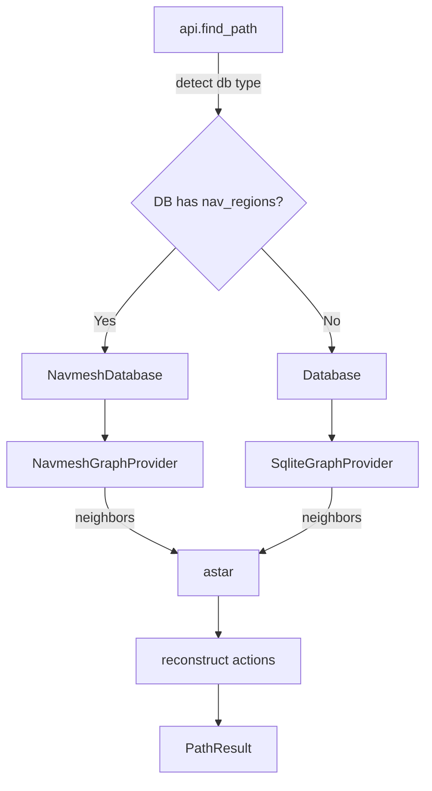

# Design: navmesh-astar

## Overview
Implement a region-graph-backed pathfinding provider that runs the same deterministic A* (`navpath/astar.py`) and preserves the public API, CLI, outputs, and behaviors of `navpath`, while using `navmesh.db` as the data source. The design introduces a `NavmeshDatabase` and `NavmeshGraphProvider` which adapt region connectivity (`nav_regions`, `nav_region_edges`) to tile-based edges so that the rest of the system remains unchanged.

## Steering Document Alignment

### Technical Standards (tech.md)
- Reuse existing interfaces (`GraphProvider`, `CostModel`, `SearchOptions`, `PathResult`) to minimize surface changes.
- Maintain deterministic ordering and stable tie-breaking as in `navpath/astar.py` and `navpath/graph.py`.
- Read-only SQLite access with parameterized queries, mirroring `navpath/db.py`.

### Project Structure (structure.md)
- Add new modules under `navpath/` without altering consumer entrypoints:
  - `navpath/navmesh_db.py` — DB helpers for `navmesh.db`.
  - `navpath/navmesh_graph.py` — `GraphProvider` implementation over regions.
  - Optional small utilities: `navpath/mesh_tiles.py` for tile selection within regions.
- Keep `navpath/api.py`, `navpath/__main__.py`, `navpath/astar.py`, `navpath/path.py`, `navpath/options.py` intact aside from provider selection wiring.

## Code Reuse Analysis

### Existing Components to Leverage
- **`navpath/astar.py`**: Deterministic A* and reconstruction remain unchanged.
- **`navpath/path.py`**: `PathResult`, `ActionStep`, `NodeRef` JSON models unchanged.
- **`navpath/options.py`**: All flags/limits/cost overrides reused.
- **`navpath/cost.py`**: Cost semantics reused; movement/node overrides honored.
- **`navpath/requirements.py`**: Requirement evaluation logic reused.

### Integration Points
- **`navpath/api.find_path()`**: Detect DB type at runtime and instantiate the proper provider:
  - If `nav_regions` exists → `NavmeshDatabase + NavmeshGraphProvider`.
  - Else → current `Database + SqliteGraphProvider`.
- **Logging**: Preserve the metrics line emitted in `navpath/api.py`.

## Architecture

- The A* search state remains tile-based. The navmesh provider maps the current tile to its `src_region_id` and yields neighbor edges to destination tiles determined by region edges and metadata.
- Costs are derived from `nav_region_edges.weight` with overrides applied for per-type categories (door, lodestone, object, ifslot, npc, item). Movement edges use the configured movement step cost.
- Deterministic neighbor ordering matches existing rules: stable by type-specific keys and destination, producing consistent queues.

## Components and Interfaces

### `NavmeshDatabase`
- **Purpose:** Read-only helper for `navmesh.db` tables with typed rows.
- **Interfaces:**
  - `connect(path) -> NavmeshDatabase`
  - `fetch_region_by_tile(x,y,p) -> Optional[RegionRow]`
  - `iter_region_edges(src_region_id) -> Iterator[RegionEdgeRow]`
  - `iter_region_tiles(region_id) -> Iterator[Tile]`
  - `tile_exists(tile: Tile) -> bool`
  - `fetch_metadata_key(key: str) -> Optional[str]`
- **Reuses:** Connection strategy from `navpath/db.py.open_connection` adapted to navmesh.

### `NavmeshGraphProvider(GraphProvider)`
- **Purpose:** Yield deterministic tile-to-tile edges computed from region graph.
- **Interfaces:** `neighbors(tile: Tile, goal: Tile, options: SearchOptions) -> Iterable[Edge]` (same as `SqliteGraphProvider`).
- **Dependencies:** `NavmeshDatabase`, `CostModel`, `SearchOptions`, `evaluate_requirement`.
- **Edge generation strategy:**
  1. Resolve `src_region` via `region_tiles` index; if None, raise `TileNotFoundError` → API returns `"tile-not-found"`.
  2. Movement edges: from `nav_region_edges` where `type='move'`, use `meta.border_sample` to choose the exact `(from,to)` tile pair across the border; fallback to deterministic scan of shared boundary if sample missing.
  3. Special edges (`door|lodestone|object|ifslot|npc|item`):
     - Requirement gating via `meta.requirement_id` against `requirements` table when present; otherwise treat missing rows as unmet.
     - Destination tile selection:
       - Prefer explicit sample if present in `meta` (e.g., `border_sample.to`).
       - Else choose the first existing tile in destination region by ascending `(x,y)`; plane from region.
     - Cost: start from `weight` and apply type-specific overrides from `SearchOptions` via `CostModel`.
     - Chain semantics: if `meta.chain` exists, embed it into `Edge.metadata['chain']` so `_reconstruct()` expands into multiple `ActionStep`s. Otherwise, emit as single-step (compatible default).
  4. Lodestones only emitted from `options.extras['start_tile']` (same branching reduction as tiles provider).
  5. Deterministic sort: stable per-type keys, then `to_tile`, then node id when available.

### Utility: `TileSelector`
- **Purpose:** Deterministically pick a concrete tile inside a region or along a border.
- **Rules:** Scan `x` then `y`; ensure tile exists via `tile_exists()`; prefer border samples when available.

## Data Models

### `RegionRow`
- `id: int`
- `plane: int`
- `min_x: int; min_y: int; max_x: int; max_y: int`
- `area: int`
- `category: Optional[str]`
- `meta: Optional[str]` (raw JSON)

### `RegionEdgeRow`
- `src_region_id: int`
- `dst_region_id: int`
- `weight: int` (ms)
- `type: str` in {`move`,`door`,`lodestone`,`object`,`ifslot`,`npc`,`item`}
- `meta: Optional[str]` (JSON with per-type fields; may include `border_sample`, `head_id`, `requirement_id`, and optional flattened `chain`)

## Error Handling

### Error Scenarios
1. **Unknown input tile**
   - **Handling:** Raise `TileNotFoundError`; API returns `reason="tile-not-found"`.
   - **User Impact:** Clear message, no crash.
2. **Malformed meta JSON**
   - **Handling:** Log at DEBUG, skip the edge; continue search.
   - **User Impact:** Potentially fewer edges; determinism preserved.
3. **Missing `requirements` row for `requirement_id`**
   - **Handling:** Treat as unmet; increment `req_filtered_count`.
   - **User Impact:** Edge gated out.
4. **No tile found in destination region**
   - **Handling:** Skip edge; continue.
5. **Timeout/expansion limit**
   - **Handling:** Same as existing A*; return `timeout` or `max-expansions`.

## Testing Strategy

### Unit Testing
- `NavmeshTileSelector`: deterministic tile selection and border sampling.
- `NavmeshGraphProvider.neighbors()`: per-type edge generation, gating, costs, and ordering.

### Integration Testing
- End-to-end parity via CLI using `--json` and `--json-actions-only` to compare shapes with the tiles-based provider on controlled cases.
- Mixed DB detection: verify `api.find_path()` picks the correct provider given `db_path`.

### End-to-End Testing
- Large representative routes: assert determinism and performance targets (≥2× fewer expansions vs. tiles on large open areas where applicable).
- Requirements gating scenarios exercising pass/fail and missing rows.

## Implementation Plan (high level)
- Add `navmesh_db.py` with typed row helpers and read-only connection.
- Add `navmesh_graph.py` implementing `GraphProvider` using `NavmeshDatabase`:
  - Movement edges from `nav_region_edges(type='move')` with `border_sample`.
  - Special edges with requirement gating and optional `chain` metadata.
- Update `api.find_path()` to detect DB type and choose provider; keep signature and logging unchanged.
- Keep `_reconstruct()` in `astar.py` unchanged; it already expands `Edge.metadata['chain']` when present.
- Preserve CLI flags and `SearchOptions` mapping without changes.
