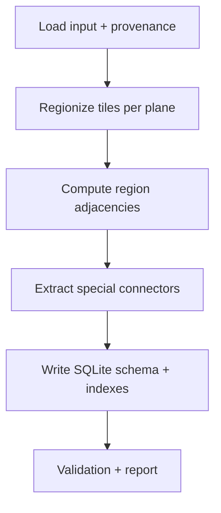

# Design Document

## Overview

Build a static, region-based navmesh from `worldReachableTiles.db` to shift computation from runtime to build-time. The build tool groups contiguous walkable tiles into deterministic regions and emits a compact SQLite database with region nodes and edges, including special connectors derived from nodes (doors, lodestones, object/NPC/ifslot/item). The output is optimized for fast neighbor queries during pathfinding.

Deliverables:
- CLI: `python -m navpath.navmesh_build` to produce `navmesh.db`.
- SQLite schema: `nav_regions`, `nav_region_edges`, `region_tiles`, `metadata`.
- Deterministic, idempotent build with provenance and validation summary.

## Steering Document Alignment

### Technical Standards (tech.md)
- Parameterized SQLite, no raw string interpolation. Follow `navpath/db.py` practices.
- Deterministic ordering, stable IDs. Prefer iterative streaming to avoid excessive RAM.
- Logging with standard library.

### Project Structure (structure.md)
- New build package under `navpath/navmesh_build/` for modularity:
  - `navmesh_build/__main__.py` (CLI entrypoint)
  - `navmesh_build/regionizer.py` (tile→region grouping)
  - `navmesh_build/connectors.py` (doors/lodestones/objects/npcs/ifslots/items → region edges)
  - `navmesh_build/schema.py` (DDL and writers)
  - `navmesh_build/provenance.py`
  - `navmesh_build/report.py`
- Optional runtime provider later: `navpath/region_graph.py` to consume `navmesh.db` (future phase, not part of this build deliverable).

## Code Reuse Analysis

### Existing Components to Leverage
- **`navpath/db.py`**: Read-only access to `tiles` and node tables; reuse for input side.
- **`navpath/options.py`**: Cost override knobs are informative for mapping default costs but not used at build-time; keep values in metadata.
- **`navpath/cost.py`**: Constants help align default costs; build will not compute heuristics.
- **`navpath/graph.py`**: Reference semantics for allowed directions, door/lodestone behavior, requirement gating. Use as behavioral source of truth when projecting node semantics onto regions.

### Integration Points
- **Input DB**: Reuse `Database` queries to stream tiles and nodes.
- **Output DB**: New DDL via `schema.py`, batch inserts, and indexes per requirements.
- **Future Runtime**: A `RegionGraphProvider` can read `navmesh.db` to provide neighbors; mirrors `SqliteGraphProvider` API.

## Architecture

The builder operates in phases to ensure determinism and streaming behavior:

1) Load input metadata and compute provenance hash of `worldReachableTiles.db` and config.
2) Regionization per plane:
   - Stream tiles in deterministic scan order (plane asc, y asc, x asc).
   - Use union-find or flood-fill grouping based on 4-neighbor adjacency permitted by `allowed_directions`/`blocked_directions`.
   - Do not cross door boundaries; treat blocked directions as hard boundaries; ignore diagonal-only contacts.
   - Assign stable region IDs in discovery order per global ordering (plane, then min_y, min_x of region bounding box).
   - Record tiles→region in `region_tiles`; accumulate per-region bbox and area.
3) Build region adjacency edges:
   - For each frontier between two regions that share at least one valid side transition, add a movement edge between regions.
   - Weight: default movement cost as base (collapsed intra-region cost is 0; inter-region represents a step across a border). Store border sample coordinate in `meta` for traceability.
4) Build special connectors via node preprocessing:
   - Doors: map inside/outside tiles to their regions; add directed edges with type `door`, cost from node or default; propagate `direction`, `real_id_*`, `open_action`, requirement gating metadata.
   - Lodestones: from any region to destination region (single edge) with type `lodestone` and cost; requirement gates.
   - Objects/NPCs/Ifslots/Items: deterministically select a destination tile within bounds (as `graph._select_dest_tile` does) and map origin/destination to regions; create edges with chain metadata (if chains are resolved during build) or store only head and `next_node_*` metadata for runtime chain evaluation. For build, we store head metadata and raw node ids; full chain expansion can remain a runtime concern.
5) Write schema and indexes; insert metadata and validation summary.

### Modular Design Principles
- **Single File Responsibility**: Separate readers, regionizer, connectors, and writers.
- **Component Isolation**: Builders produce plain data structures which writers persist.
- **Service Layer Separation**: No direct SQL in algorithmic modules; use `schema.py` for persistence.

## Components and Interfaces

### `Regionizer`
- **Purpose:** Group tiles into deterministic regions.
- **Interfaces:**
  - `build_regions(db: Database, planes: Optional[Set[int]]) -> Iterator[Region]`
  - `Region` fields: `id`, `plane`, `bbox(min_x,min_y,max_x,max_y)`, `area`, `tiles: Iterable[Tile]`, `meta`.
- **Dependencies:** `navpath/db.Database` for `tiles` streaming.

### `AdjacencyBuilder`
- **Purpose:** Discover neighboring region pairs and emit movement edges.
- **Interfaces:** `build_adjacencies(regions_index) -> Iterator[RegionEdge]`
- **Edge fields:** `src_region_id`, `dst_region_id`, `type="move"`, `weight`, `meta` (e.g., `border_sample`).

### `ConnectorExtractor`
- **Purpose:** Convert node tables to region edges.
- **Interfaces:** `extract_edges(db: Database, tile_to_region, config) -> Iterator[RegionEdge]`
- **Dependencies:** `db.iter_*` methods; requirement gating logic aligned with `requirements.evaluate_requirement`.

### `SchemaWriter`
- **Purpose:** Create schema and batch insert rows.
- **Interfaces:**
  - `create_schema(conn)`
  - `insert_regions(regions)`
  - `insert_region_tiles(mappings)`
  - `insert_edges(edges)`
  - `insert_metadata(pairs)`

### `Provenance`
- **Purpose:** Record input path hash, schema snapshot, build timestamp, version, config hash.

### `Report`
- **Purpose:** Summarize counts and anomalies; warn and continue for recoverable issues.

## Data Models

### SQLite Tables
- `nav_regions(id INTEGER PRIMARY KEY, plane INT, min_x INT, min_y INT, max_x INT, max_y INT, area INT, category TEXT, meta TEXT)`
- `nav_region_edges(src_region_id INT, dst_region_id INT, weight REAL, type TEXT, meta TEXT)`
- `region_tiles(region_id INT, x INT, y INT, plane INT)`
- `metadata(key TEXT PRIMARY KEY, value TEXT)`

### Indexes
- `CREATE INDEX idx_regions_plane ON nav_regions(plane);`
- `CREATE INDEX idx_region_tiles_xyz ON region_tiles(x,y,plane);`
- `CREATE INDEX idx_region_edges_src ON nav_region_edges(src_region_id);`
- `CREATE INDEX idx_region_edges_dst ON nav_region_edges(dst_region_id);`

### ID Assignment
- Regions get increasing IDs by (plane asc, region.min_y asc, region.min_x asc).
- Edges are implicit rows; no PK required beyond rowid.

## Algorithms

### Regionization
- Iterate tiles by (plane, y, x). A tile is walkable if `allowed_directions` resolves to non-zero.
- For each unvisited walkable tile, BFS/DFS expand to neighbors permitted by the tile’s `allowed_directions`, respecting blocked directions and ignoring diagonal-only contacts.
- Boundary handling:
  - Do not traverse across door boundaries; doors create connectors, not membership.
  - Multiple planes independent.
- Determinism: scan/queue ordering is fixed; union-find merges in index order only.

### Adjacency Discovery
- For each tile at a region boundary, inspect 4-neighbors; if neighbor belongs to a different region and the transition is permitted both ways, record an adjacency (deduped by `(src,dst)`).
- Edge weight: base movement cost (from `cost.DEFAULT_STEP_COST_MS`) or `1` if building in abstract units; store chosen base in `metadata`.

### Connectors Extraction
- Doors: directed edges between interior/exterior regions; include node ids, `direction`, `real_id_open/closed`, `open_action`, `requirement_id` in `meta`.
- Lodestones: from any region to destination region; single edge per lodestone id.
- Objects/NPCs/Ifslots/Items: pick deterministic destination tile within bounds (scan x then y); map to regions; store head node id and raw `next_node_*` fields in `meta`. Chain resolution can be runtime to keep build simpler and DB smaller.
- Requirement gating: copy requirement metadata; evaluation is runtime concern.

## Error Handling

### Error Scenarios
1. **Input missing or unreadable**
   - Handling: exit non-zero; clear message.
2. **Schema mismatch**
   - Handling: detect via required columns; exit non-zero with hint.
3. **Orphan specials** (dest tile doesn’t exist or no region)
   - Handling: warn and skip; count in report.
4. **DB locked / write failure**
   - Handling: retry limited; fail non-zero if persistent.

## Performance
- Stream tiles per plane; avoid loading full map.
- Batch inserts with executemany; wrap in transactions.
- Pragmas when safe: `journal_mode=WAL`, `synchronous=NORMAL`.
- Avoid N+1 by prefetching small node tables.
## Determinism & Idempotence
- Stable iteration order and seedless algorithms.
- Sorted insertion order for all rows.
- Region IDs derived only from discovered order/bounds; persisted mapping ensures reproducibility.

## CLI and Configuration
 - Module: `navpath.navmesh_build` with flags:
  - `--input PATH` (required), `--output PATH` (required)
  - `--planes <list|all>`
  - `--dry-run`, `--overwrite`
  - Optional base costs: `--cost-base`, `--cost-door`, `--cost-lodestone`, etc. (stored in `metadata`)
 - Help text documents defaults and schema.
