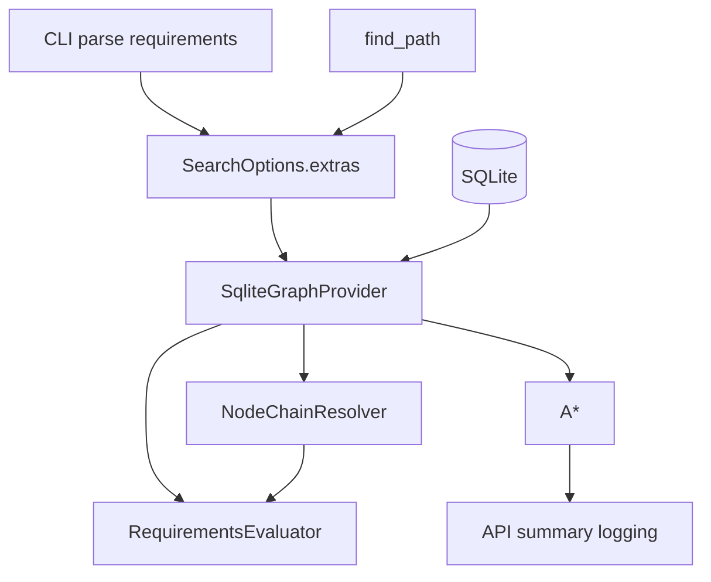

# Design: Requirements-aware Pathfinding

## Overview

Implement requirement-based gating across all node types (door, lodestone, object, ifslot, npc, item). Nodes referencing `requirements(id)` via `requirement_id` are eligible only when the requirement evaluates true against a per-request context supplied by callers. The context is a JSON array of `{key, value}` objects (values are integers; CLI coerces booleans to 1/0). Gating applies to single nodes and to every link in `next_node` chains.

This design introduces:
- CLI flags to ingest the requirements array and coerce booleans.
- A lightweight `RequirementsEvaluator` utility to evaluate a requirement row against the request context.
- Minimal DB access additions to fetch requirement rows and expose `requirement_id` in node row models.
- Graph-layer gating performed early, before sorting/ordering, and integrated with chain resolution.
- Metrics to count requirement-filtered nodes.

## Steering Document Alignment

### Technical Standards (tech.md)
- Deterministic behavior preserved: gating is applied prior to neighbor ordering and uses stable sorts already present in `graph.py`.
- Single-responsibility: parsing in CLI, evaluation in dedicated utility, integration in graph provider.
- Read-only, parameterized SQL maintained.

### Project Structure (structure.md)
- Keep additions minimal and localized: CLI parsing (`navpath/__main__.py`), small DB helper (`navpath/db.py`), evaluator utility (`navpath/requirements.py`), integration in graph (`navpath/graph.py`) and chain resolver (`navpath/nodes.py`).

## Code Reuse Analysis

### Existing Components to Leverage
- **`SearchOptions.extras`**: Vehicle to pass the requirements list from CLI/API into the graph.
- **`SqliteGraphProvider` in `navpath/graph.py`**: Central place to integrate gating for neighbor generation and for action chain edges.
- **`NodeChainResolver` in `navpath/nodes.py`**: Integrate gating on each chain link.
- **`CostModel`** and A*: unchanged; they consume the already-gated neighbors.

### Integration Points
- **CLI (`navpath/__main__.py`)**: Add flags, parse JSON array, coerce booleans, validate integers, place into `SearchOptions.extras["requirements"]`.
- **API (`navpath/api.py`)**: No signature change. Ensure `options.extras` is a dict; pass through. Optionally normalize list to a dict cache in extras for efficiency.
- **DB (`navpath/db.py`)**: Add `requirement_id` to node row models and SELECTs; add `fetch_requirement(req_id)`.
- **Graph (`navpath/graph.py`)**: Before yielding any edge, gate by requirement using evaluator and the request context.
- **Nodes (`navpath/nodes.py`)**: In chain resolution, gate each link; fail the chain if any link fails.

## Architecture



### Modular Design Principles
- **Single File Responsibility**: Evaluator is isolated; DB helpers remain read-only; CLI handles only parsing/coercion.
- **Component Isolation**: Gating logic is a small API used by both graph and chain resolver.
- **Service Layer Separation**: DB access stays in `db.py`; no SQL in graph beyond existing queries.

## Components and Interfaces

### CLI changes (`navpath/__main__.py`)
- **Purpose:** Ingest requirement context as a JSON array and coerce booleans.
- **Interfaces:**
  - New args: `--requirements-file PATH`, `--requirements-json JSON_STRING`.
  - Behavior:
    - Load array from file and/or parse string; merge with last-wins by `key`.
    - Coerce boolean literals `true`/`false` to `1`/`0` before validation.
    - Validate each item: must be object with `key` (string) and `value` (int after coercion). Reject on invalid with clear error and non-zero exit.
  - Place final array into `options.extras["requirements"]`.

### API (`navpath/api.py`)
- **Purpose:** Pass through requirements context and include metrics in logs.
- **Interfaces:**
  - No signature change; `SearchOptions.extras["requirements"]` is the carrier.
  - Normalization (optional): on entry, if extras list is present, build an internal dict `extras["requirements_map"]: Dict[str,int]` for O(1) lookups. Retain the original list for API compatibility.
  - Logging: include `req_filtered` count from graph provider in the INFO summary line. If not available, default to 0.

### DB helpers (`navpath/db.py`)
- **Purpose:** Supply `requirement_id` for nodes and fetch requirement rows.
- **Changes:**
  - Extend dataclasses to include `requirement_id: Optional[int]` for: `DoorNodeRow`, `LodestoneNodeRow`, `ObjectNodeRow`, `IfslotNodeRow`, `NpcNodeRow`, `ItemNodeRow`.
  - Update SELECT lists to include `requirement_id` columns for corresponding tables.
  - New dataclass:
    ```python
    @dataclass(slots=True)
    class RequirementRow:
        id: int
        metaInfo: Optional[str]
        key: str
        value: int
        comparison: str
    ```
  - New method:
    ```python
    def fetch_requirement(self, req_id: int) -> Optional[RequirementRow]:
        row = conn.execute(
            "SELECT id, metaInfo, key, value, comparison FROM requirements WHERE id = ?",
            (req_id,),
        ).fetchone()
        return None if row is None else RequirementRow(...)
    ```

### Requirements evaluator (`navpath/requirements.py`)
- **Purpose:** Evaluate a single requirement against the context.
- **Interface:**
  ```python
  def evaluate_requirement(req: RequirementRow, ctx_map: Dict[str, int]) -> bool:
      # Missing key => False (not available)
      v = ctx_map.get(req.key)
      if v is None:
          return False
      rv = int(req.value)
      op = req.comparison
      if op == "=": return v == rv
      if op == "!=": return v != rv
      if op == "<": return v < rv
      if op == "<=": return v <= rv
      if op == ">": return v > rv
      if op == ">=": return v >= rv
      return False  # unknown operators are treated as unmet
  ```
- **Notes:** Integers only. Deterministic semantics.

### Graph provider (`navpath/graph.py`)
- **Purpose:** Gate neighbors early, count filtered nodes, and keep deterministic ordering.
- **Changes:**
  - On construction, accept `options.extras` and build `ctx_map` from `extras["requirements"]` (list) or `extras.get("requirements_map")` if normalized by API.
  - Maintain `self.req_filtered_count: int = 0`.
  - For each candidate neighbor/edge sourced from any node row:
    - If `row.requirement_id` is not None: fetch requirement row (with a small LRU cache in-memory keyed by id), evaluate with `ctx_map`.
    - If evaluation is False: increment `req_filtered_count` and skip emitting the edge.
  - Preserve existing deterministic ordering and only sort/emit after gating.

### Node chain resolver (`navpath/nodes.py`)
- **Purpose:** Integrate gating into `next_node` chain resolution.
- **Changes:**
  - Before processing a link, gate it using the same evaluator and `ctx_map`.
  - If any link in the chain fails gating, abort resolution for that head and report as not resolvable.
  - Existing cycle/missing bounds checks remain unchanged.

## Data Models

### RequirementRow (new)
```
- id: int
- metaInfo: Optional[str]
- key: str
- value: int
- comparison: str  # one of = != < <= > >=
```

### Extras additions (no schema change)
```
SearchOptions.extras["requirements"]: List[{key: str, value: int}]
SearchOptions.extras["requirements_map"]: Dict[str,int]  # optional normalized cache
```

## Error Handling

### Error Scenarios
1. **Invalid requirements JSON (CLI)**
   - **Handling:** Print clear error; exit non-zero. No partial execution.
   - **User Impact:** Command fails fast with message indicating offending element or parse error.

2. **Non-integer value after coercion (CLI)**
   - **Handling:** Print error, non-zero exit.
   - **User Impact:** Command fails; instruct to use ints (booleans as 1/0).

3. **Unknown operator in DB**
   - **Handling:** Evaluator returns False, effectively gating out the node.
   - **User Impact:** Node is ignored; deterministic behavior preserved.

4. **Requirement row missing**
   - **Handling:** Treat as unmet (False) and skip; log DEBUG once per id.
   - **User Impact:** Node ignored.

## Testing Strategy

### Unit Testing
- Evaluator: all operators with boundary conditions.
- CLI parsing: file/string sources, boolean coercion, merge semantics, invalid cases.

### Integration Testing
- Graph gating: craft in-memory SQLite test DB with nodes referencing requirements; verify edges emitted only when satisfied.
- Chain gating: multi-link chains where one link fails; ensure chain excluded.

### End-to-End Testing
- CLI to `find_path` on test DB: confirm different contexts produce/skip certain paths; verify `req_filtered` count in logs.

## Implementation Notes
- Caching: Cache fetched requirement rows by id in graph to minimize queries.
- Performance: Convert requirements list to a dict once; evaluator is simple integer comparisons.
- Logging: Add `req_filtered` to API summary: `... req_filtered=%d ...`.
