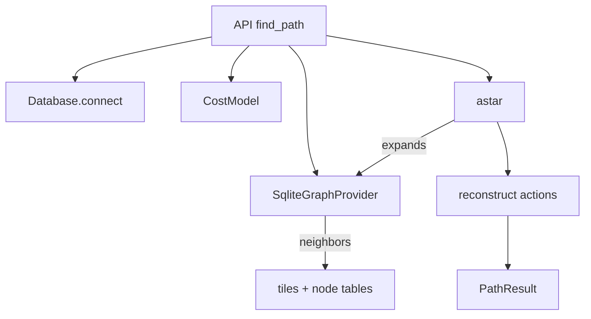

# navpath: A* pathfinding over a SQLite world graph

`navpath` is a deterministic A* pathfinding library and CLI that operates over a world graph stored in SQLite. It supports movement across tiles, door traversal, global lodestone teleports, and action "portal" edges defined by object, interface-slot, NPC, and item nodes. Complex action chains are supported via `next_node` references and are resolved into composable steps.

- Deterministic A* with stable tie-breaking and predictable edge ordering.
- Read-only, parameterized SQLite access with typed rows and helpers.
- Configurable search limits, node-type toggles, and per-type cost overrides.
- JSON-friendly result models with explicit action metadata.

### Navmesh support and provider auto-detection

`navpath` supports two SQLite backends with identical API/CLI behavior:

- Tiles + node tables (e.g., `worldReachableTiles.db`)
- Navmesh regions (e.g., `navmesh.db`)

The API/CLI automatically detects a navmesh database by the presence of the `nav_regions` table and uses a region-based graph provider when found. Otherwise it falls back to the tiles provider. Metrics logging, result shapes, and CLI flags remain unchanged.


## Project layout

- `navpath/__init__.py`
  - Re-exports the primary API: `find_path`.
- `navpath/__main__.py`
  - Command-line interface for running pathfinding from the shell.
- `navpath/api.py`
  - Public entrypoint `find_path()` that orchestrates DB access, graph provider, cost model, and A*.
- `navpath/astar.py`
  - Deterministic A* implementation and path reconstruction.
- `navpath/graph.py`
  - Neighbor generation over tiles, doors, lodestones, and action chains (object/ifslot/npc/item).
- `navpath/db.py`
  - Read-only SQLite helpers and typed row models for tiles and node tables.
- `navpath/nodes.py`
  - `Bounds2D`, chain link models, and `NodeChainResolver` for `next_node` chaining.
- `navpath/options.py`
  - `SearchOptions` dataclass with toggles, limits, and per-type cost overrides.
- `navpath/path.py`
  - JSON-friendly dataclasses: `Tile`, `NodeRef`, `ActionStep`, `PathResult`.

Related schema docs live at `docs/tiles_nodes_schema.md`. Navmesh schema is documented in `docs/navmesh_schema.md`.

- `navpath/navmesh_db.py`
  - Read-only helpers and typed rows for `navmesh.db` (`nav_regions`, `nav_region_edges`, `region_tiles`, `metadata`).
- `navpath/navmesh_graph.py`
  - Region-based graph provider with deterministic movement and special edges derived from `nav_region_edges`.


## Database model (high level)

See `docs/tiles_nodes_schema.md` for authoritative details. There is no single `nodes` table — instead there are separate tables:

- `tiles` — World tiles and their movement mask (`allowed_directions`).
- `door_nodes` — Doors linking inside/outside tiles.
- `lodestone_nodes` — Global teleports to destination tiles.
- `object_nodes` — Object-based actions with optional origin/destination bounds.
- `ifslot_nodes` — Interface slot actions with destination bounds.
- `npc_nodes` — NPC actions with optional origin/destination bounds.
- `item_nodes` — Item actions with destination bounds.

Each node table may reference a `next_node_type`/`next_node_id` enabling action chains. All node tables allow `next_node_type = 'item'` where applicable.


## Public Python API

- Function: `navpath.api.find_path(start, goal, options=None, db_path=None) -> PathResult`
  - `start`, `goal`: `Tile` tuples `(x, y, plane)` of ints.
  - `options`: `SearchOptions` (see below). If omitted, defaults are used.
  - `db_path`: path to SQLite DB. Defaults to `worldReachableTiles.db` at project root when not provided (or `options.extras['db_path']`). If the DB contains `nav_regions`, a navmesh-backed provider is used automatically; otherwise the tiles provider is used.
  - Returns: `PathResult` with fields:
    - `path: Optional[List[Tile]]` — sequence of tiles or `None` if not found.
    - `actions: List[ActionStep]` — ordered steps, including chain-expanded action metadata.
    - `reason: Optional[str]` — non-null only when no path produced.
    - `expanded: int` — number of node expansions.
    - `cost_ms: int` — total path cost in milliseconds.

Possible `reason` values (non-exhaustive):

- `invalid-input` — input tiles are not `(int, int, int)` tuples.
- `tile-not-found` — start or goal tile missing in `tiles` table.
- `timeout` — wall-clock timeout exceeded.
- `max-expansions` — expansion limit exceeded.
- `unreachable` — explored space exhausted with no path.

`PathResult.to_json_dict()` returns a JSON-serializable mapping. `ActionStep.to_json_dict()` and `NodeRef.to_json_dict()` provide JSON-friendly representations.


## Command-line interface

The package is executable via `python -m navpath`:

```bash
python -m navpath --start "3200,3200,0" --goal "3210,3211,0" --json
python -m navpath --start "3200,3200,0" --goal "3210,3211,0" --db tiles.db
```

Arguments:

- Required
  - `--start x,y,plane` — start tile.
  - `--goal x,y,plane` — goal tile.
- IO
  - `--db PATH` — SQLite database path (defaults to `worldReachableTiles.db`).
  - `--json` — emit JSON instead of human-readable text.
  - `--out PATH` — write output to file.
- Limits
  - `--max-expansions N` — expansion limit.
  - `--timeout-ms N` — wall-clock timeout.
  - `--max-chain-depth N` — cap length of `next_node` chains.
- Node-type toggles (enabled by default; these flags disable)
  - `--no-doors`, `--no-lodestones`, `--no-objects`, `--no-ifslots`, `--no-npcs`, `--no-items`.
- Cost overrides (ms)
  - `--door-cost`, `--lodestone-cost`, `--object-cost`, `--ifslot-cost`, `--npc-cost`, `--item-cost`.
- Logging
  - `--log-level {CRITICAL,ERROR,WARNING,INFO,DEBUG}`.

- Requirements context
  - `--requirements-file PATH` — path to a JSON file containing an array of objects: `[{"key": string, "value": int|bool}, ...]`.
  - `--requirements-json JSON_STRING` — inline JSON string for the same array shape.
  - Booleans are coerced to integers (`true → 1`, `false → 0`).
  - When both file and string are provided, values merge with last-wins per key. Invalid JSON or schema yields a clear error and a non-zero exit code.

Human-readable output includes reason, expansions, path length, total cost, and the path tiles. JSON output uses the `to_json_dict()` shape.

Note: When `--db` points to a `navmesh.db` (containing `nav_regions`), provider selection is automatic. Outputs and metrics format are identical to the tiles backend; no additional flags are required.


## Search options and costs

`SearchOptions` fields (defaults in code):

- Toggles: `use_doors`, `use_lodestones`, `use_objects`, `use_ifslots`, `use_npcs`, `use_items`.
- Limits: `max_expansions`, `timeout_ms`, `max_chain_depth`.
- Cost overrides: `door_cost_override`, `lodestone_cost_override`, `object_cost_override`, `ifslot_cost_override`, `npc_cost_override`, `item_cost_override`.
- `extras: Dict[str, Any]` — forward-compatible bag. The graph uses `extras['start_tile']` to restrict global lodestone edges to the start node for optimal branching. For requirements-aware gating, provide:
  - `extras["requirements"]: List[{key:str, value:int}]` — a list of requirement context entries (booleans should be coerced to `1/0`; the CLI does this automatically).
  - The API automatically normalizes this list to `extras["requirements_map"]: Dict[str,int]` for faster lookups.

`CostModel` (defaults):

- Movement cost per step: 600 ms.
- Default node edge cost (when no override or DB cost provided): 600 ms.
- Heuristic: Chebyshev distance × step cost (admissible for 8-direction movement).


## Requirements-aware gating

Nodes (doors, lodestones, object/ifslot/npc/item) may reference a requirement row via `requirement_id`. When present, the node is usable only if the evaluated requirement is satisfied against the per-request context map.

- Provide the context via CLI flags (`--requirements-file`, `--requirements-json`) or programmatically in `SearchOptions.extras["requirements"]`.
- The API normalizes the list into a map at `extras["requirements_map"]` for efficient evaluation.
- Requirement comparison operators are stored in the DB row and are integer-based.
- Missing keys or unknown operators evaluate to unmet and the node is gated out.

Examples:

```bash
# Inline JSON (booleans coerced to 1/0)
python -m navpath \
  --start "3200,3200,0" \
  --goal "3210,3211,0" \
  --requirements-json '[{"key":"has_key","value":true},{"key":"agility","value":40}]'

# From file
python -m navpath \
  --start "3200,3200,0" \
  --goal "3210,3211,0" \
  --requirements-file req.json
```

Python API:

```python
from navpath import find_path
from navpath.options import SearchOptions

options = SearchOptions()
options.extras["requirements"] = [
    {"key": "has_key", "value": 1},
    {"key": "agility", "value": 40},
]

result = find_path((3200,3200,0), (3210,3211,0), options=options)
```

## Graph semantics and neighbor generation

Implemented in `navpath/graph.py` as `SqliteGraphProvider`.

- Movement edges (`type="move"`)
  - Decodes `tiles.allowed_directions` bitmask or comma-separated tokens.
  - Cardinal moves ordered first, then diagonals, yielding deterministic edge order.
  - Only yields moves to tiles present in the DB.
- Door edges (`type="door"`)
  - Traverses between `tile_inside` and `tile_outside` if the current tile matches either.
  - Skips doors whose node is referenced as a `next_node` (non-chain-head filtering).
  - Metadata includes `door_direction`, `real_id_open`, `real_id_closed`, and optional `action`.
- Lodestone edges (`type="lodestone"`)
  - Global teleports to `dest` tiles. Emitted only from the start tile (via `extras['start_tile']`) to reduce branching without losing optimality.
  - Deterministically sorted by node id, then destination.
  - Metadata includes `lodestone` name.
- Action edges with chain semantics (`type in {object, ifslot, npc, item}`)
  - Uses `NodeChainResolver` (`navpath/nodes.py`) to resolve `next_node` chains starting at the chain-head node.
  - The resolver:
    - Aggregates per-node costs using `CostModel` with overrides.
    - Tracks chain depth, rejects cycles, missing nodes, and chains without destination bounds.
    - Produces a `ChainResolution` with `links`, `total_cost_ms`, and terminal `destination` bounds.
  - Destination tile selection: deterministic scan within terminal bounds (x then y), using current plane if bounds plane is `NULL`, and only accepting tiles that exist in the DB.
  - Chain-head filtering: nodes referenced as someone else’s `next_node` are not emitted as independent heads.
  - Per-type metadata copied onto the edge and each chain link, when present:
    - `object`: `action`, `object_id`, `object_name`, `match_type`.
    - `ifslot`: `interface_id`, `component_id`, `slot_id`, `click_id`.
    - `npc`: `action`, `npc_id`, `npc_name`, `match_type`.
    - `item`: `action`, `item_id`.

Action chain metadata is exposed to callers and also flattened into `ActionStep`s during path reconstruction.


## A* search and path reconstruction

- Deterministic priority queue ordering with stable tie-breaking.
- Stops on:
  - Timeout (`reason="timeout"`).
  - Expansion limit (`reason="max-expansions"`).
  - Goal reached: reconstructs tiles and action steps.
  - Exhausted search space (`reason="unreachable"`).
- Reconstruction:
  - For each non-movement edge, emits a chain of `ActionStep`s: intermediate links have zero tile movement, the last link moves to the edge destination.
  - Movement steps (`type="move"`) are emitted per tile transition.


## Logging and metrics

`find_path()` logs a concise summary at INFO:

- `start`, `goal`, `reason`, `expanded`, `path_len`, `total_cost_ms`, `duration_ms`, `req_filtered`, `db`.

Configure logging via CLI `--log-level` or in your application before calling the API.


## Example usage (Python)

```python
from navpath import find_path
from navpath.options import SearchOptions

start = (3200, 3200, 0)
goal = (3210, 3211, 0)

options = SearchOptions(
    use_lodestones=True,
    max_expansions=1_000_000,
    timeout_ms=10_000,
)

result = find_path(start, goal, options=options)  # or db_path="/path/to/tiles.db"

print(result.reason, result.expanded, result.cost_ms)
for step in result.actions:
    print(step.type, step.from_tile, "->", step.to_tile, step.cost_ms, step.metadata)
```


## Architecture overview




## Extensibility notes

- New node types can follow the `db.fetch_node()` dispatch pattern and integrate into `NodeChainResolver` and `SqliteGraphProvider` similarly to existing types.
- `SearchOptions.extras` provides forward compatibility for additional flags (e.g., per-request hints to the graph layer).
- Costs and heuristics are centralized in `CostModel` to keep search and graph deterministic and tunable.


## Limitations and assumptions

- The DB must contain the start and goal tiles; otherwise `reason="tile-not-found"`.
- `allowed_directions` must either be an integer bitmask or comma-separated tokens understood by the graph; unknown tokens are ignored.
- Chain resolution skips nodes missing destination bounds or failing safety checks; these do not halt the search but the associated edges will not be emitted.
- All SQLite access is read-only; schema must match `docs/tiles_nodes_schema.md`.
